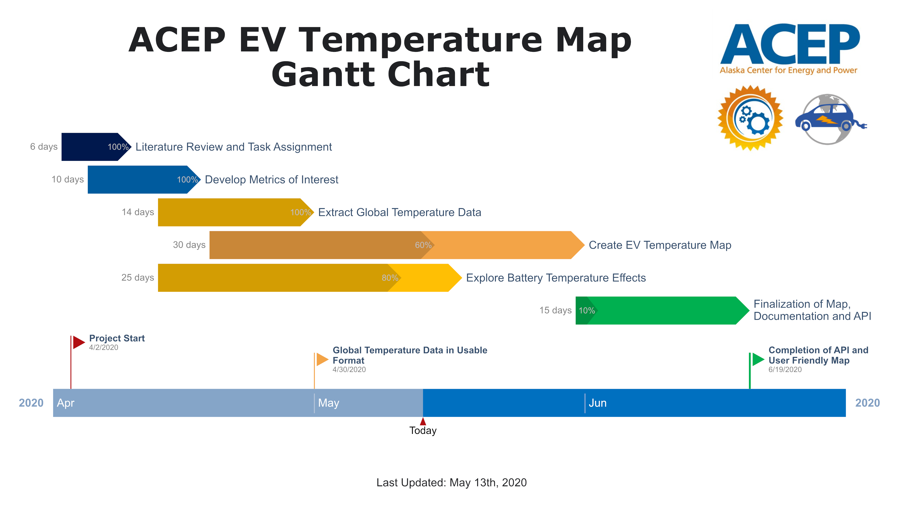

# Electric Vehicle Temperature Map 

The creation of a world map, or maps, of ‘EV degree days’ showing zones indicating temperature regimes of consideration for Electric Vehicle (EV) use.

EV batteries can freeze, if left unplugged long enough, in temperatures below -20C. Battery life is lower when they are regularly subjected to high temperatures.  Range is decreased (dependent on temperature) when power must be used to heat or cool batteries or the cabin.  The product envisioned in this project would have something in common with USDA growing zone maps, showing where plants may suffer winter injury from minimum temperatures, and with engineering design temperature or heating degree day and cooling degree day information, and would allow analysis of EV range, efficiency, etc depending on location.

## Timeline

The expected duration of specific tasks is shown below in the following gantt chart. These timelines are flexible and will be continued to be updated. A more interactive gantt chart can be found in the `/docs` folder.

Last Updated: April 15th, 2020

## Current Map Progress

*Below we can see progress made on the end-user map/tool.*

This map shows the temperature at any location in 2 week incriments.

You can also see the viualiztion [here](https://ace-p.github.io/map/index.html).

<noscript></noscript><object class='tableauViz'  style='display:none;'><param name='host_url' value='https%3A%2F%2Fpublic.tableau.com%2F' /> <param name='embed_code_version' value='3' /> <param name='site_root' value='' /><param name='name' value='DashboardWorking_15919087869820&#47;Home' /><param name='tabs' value='yes' /><param name='toolbar' value='yes' /><param name='static_image' value='https:&#47;&#47;public.tableau.com&#47;static&#47;images&#47;Da&#47;DashboardWorking_15919087869820&#47;Home&#47;1.png' /> <param name='animate_transition' value='yes' /><param name='display_static_image' value='yes' /><param name='display_spinner' value='yes' /><param name='display_overlay' value='yes' /><param name='display_count' value='yes' /><param name='language' value='en' /><param name='filter' value='publish=yes' /></object>
                
